# Refined Bricklink

> A browser extension that adds quality-of-life improvements to [bricklink.com](https://www.bricklink.com)

[](https://github.com/fantapop/refined-bricklink/releases)
[](LICENSE)

Inspired by [Refined GitHub](https://github.com/refined-github/refined-github). Each improvement is independently toggleable from the extension's options page.

---

## Options

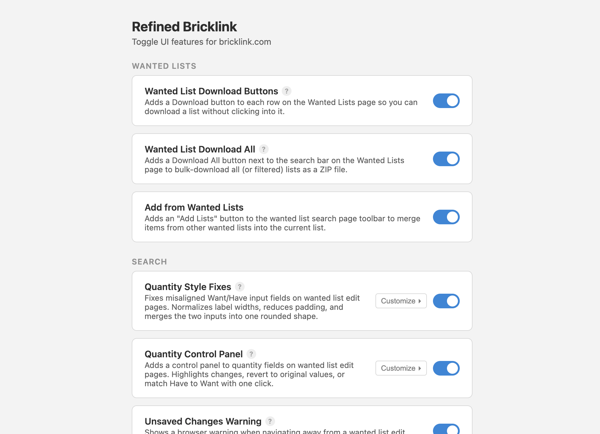

---

## Features

### Wanted Lists

#### Hideable Wanted Lists

Hides wanted lists whose names end with a configurable suffix (default: ` [x]`) from all views — the management page, upload dropdown, and "Add to Wanted List" modal. A **Hide** button is injected into the Setup modal so you can hide or unhide a list without manually editing its name. A **Show hidden** checkbox in the table header lets you reveal hidden lists when needed.

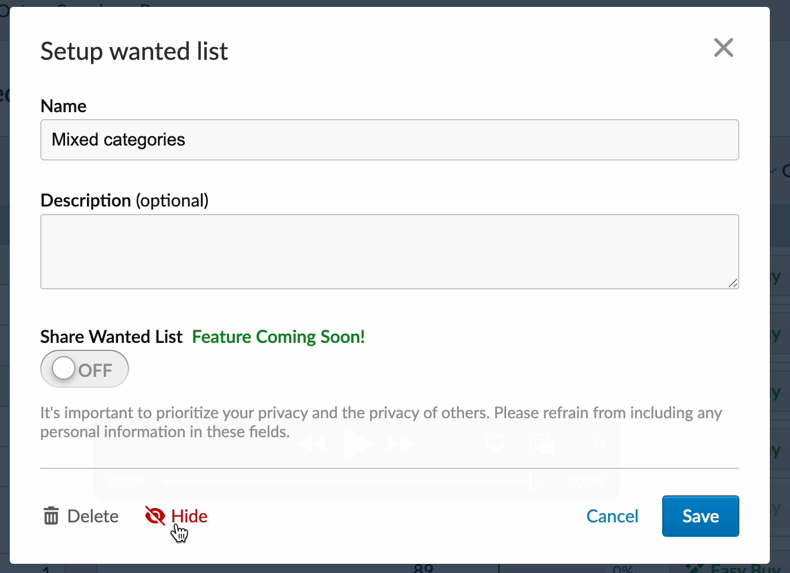

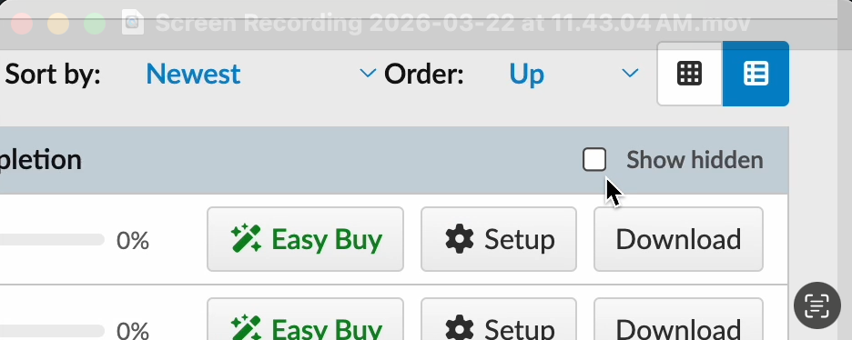

<br>

#### Download Buttons

Adds a Download button to each row on the Wanted Lists page so you can download a list without clicking into it.

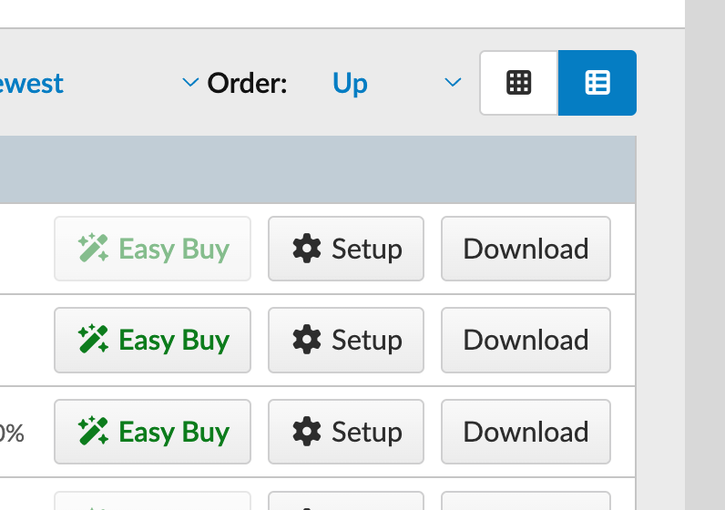

<br>

#### Download All

Adds a button next to the search bar to bulk-download all your wanted lists as a ZIP file. When the search filter is active it downloads only the matching lists. If only one list is visible it downloads that list directly as XML.

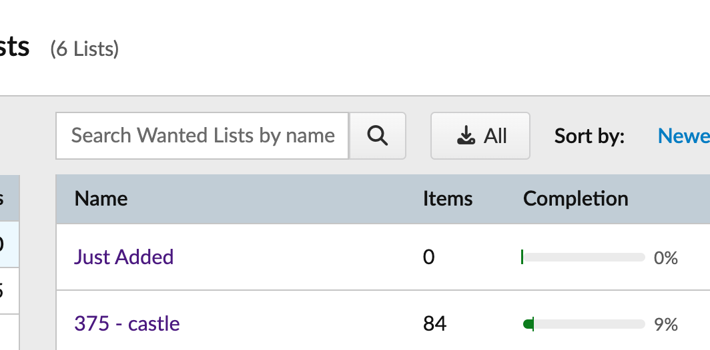

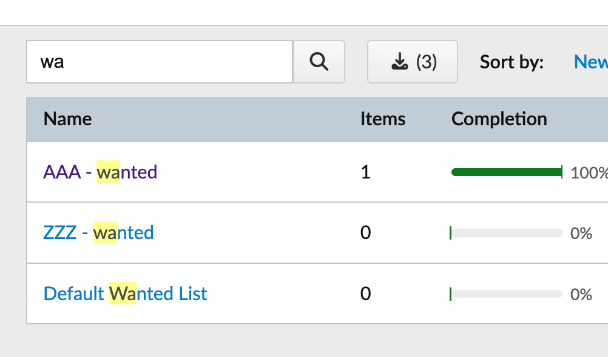

#### Default Page Size

Rewrites wanted list links to open directly with your preferred number of items per page, so you never have to change the selector manually. Configure the default via the Customize panel (e.g. 100 or 500).

#### Custom Page Size Options

Replaces the items-per-page dropdown on wanted list search pages with a configurable set of values. The default options are 50, 100, 250, and 500 — but you can enter any comma-separated list in the Customize panel. The Default Page Size setting above automatically reflects your configured options.

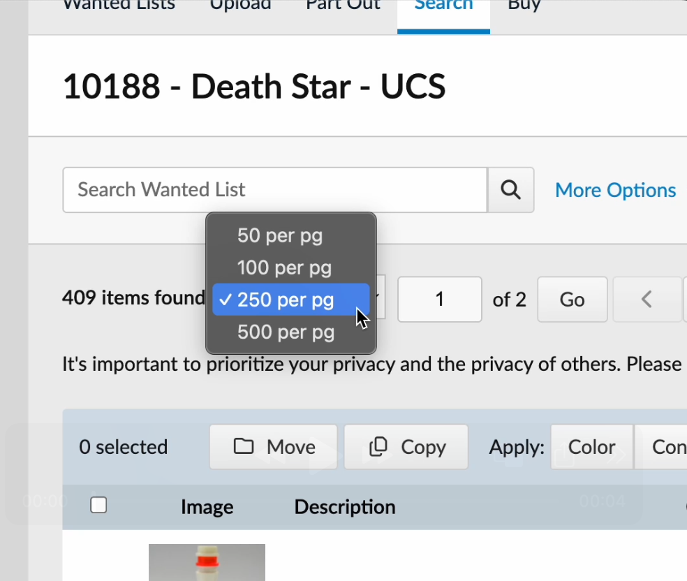

### Search

#### Set Detective

Adds a **Set Detective** tab to the wanted list pages. Enter one or more parts with colors and minimum quantities, and Set Detective searches BrickLink to find every set that contains all of them — useful for identifying which set a partially assembled model came from.

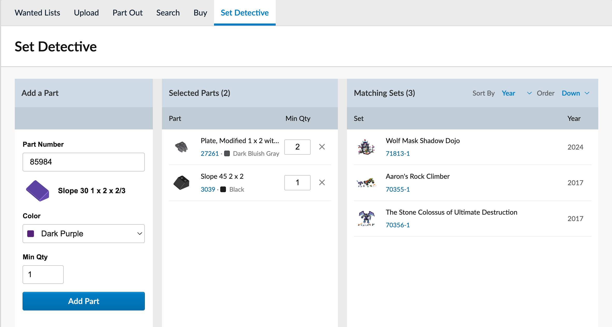

<br>

#### Quantity Control Panel

Adds match Have↔Want and revert controls to quantity fields on wanted list edit pages. Highlights changed rows in orange.

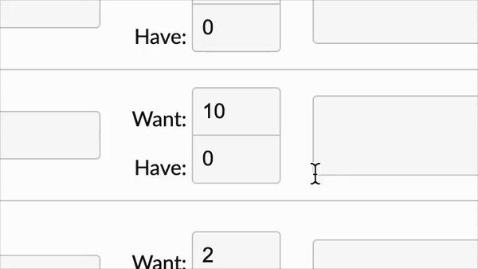

<br>

#### Max Price Revert Button

Adds a revert control to max price fields on wanted list edit pages.

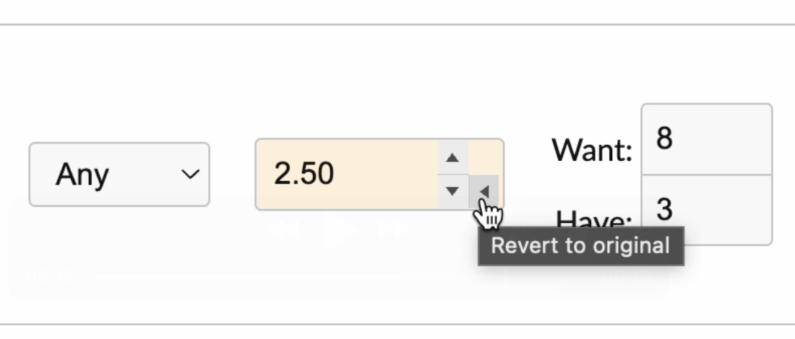

<br>

#### Edit Summary Banner

Shows a live count of changed fields in the save banner while editing a wanted list. Hover the summary to see a breakdown by row and field.

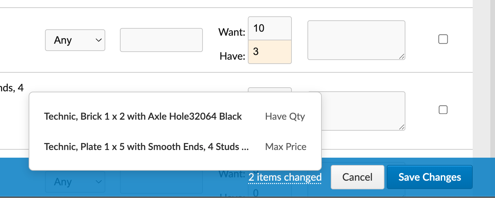

<br>

#### Unsaved Changes Warning

Shows a browser confirmation dialog when you try to navigate away from a wanted list edit page that has unsaved changes.

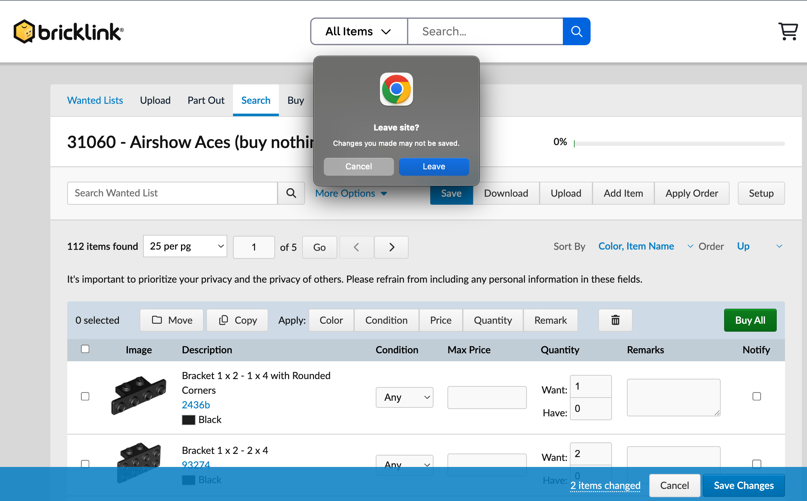

<br>

#### Smart Wanted List Filters

On wanted list search pages, filters the Color and Condition dropdowns to only show values that exist in your list. Automatically selects and locks the filter if all items share the same value.

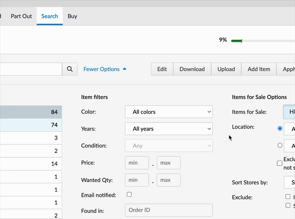

<br>

#### Quantity Style Fixes

Tightens padding on quantity input fields to make room for control panels and reduce visual clutter.

| Before | After |
|--------|-------|
| 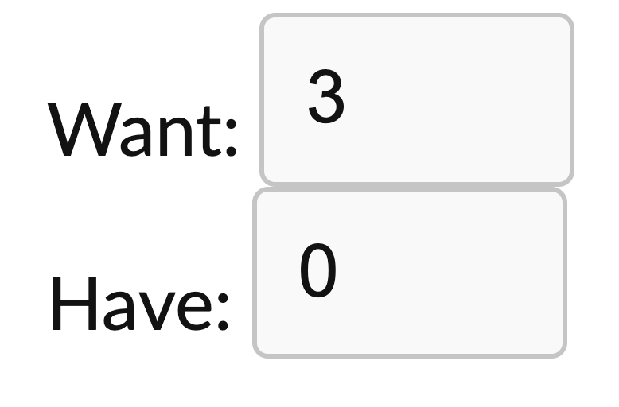 | 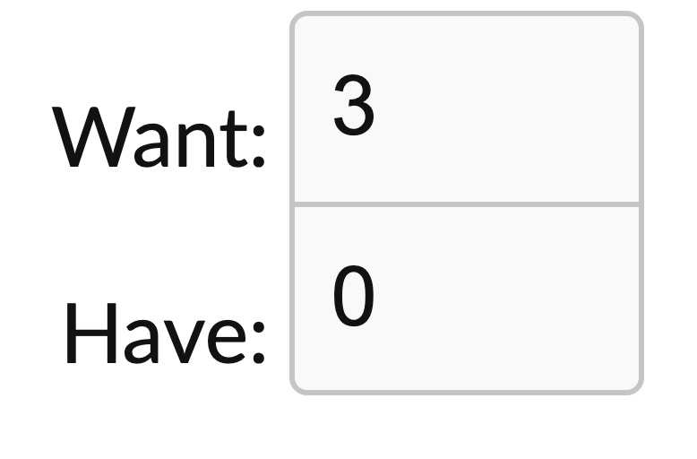 |

#### Add from Wanted Lists

Adds an "Add Lists" button to the wanted list search page toolbar. Opens a modal to select other wanted lists, preview merged items, and upload them into the current list. Supports filtering by item type, "unfulfilled only" mode, and optionally appends the source list name to remarks.

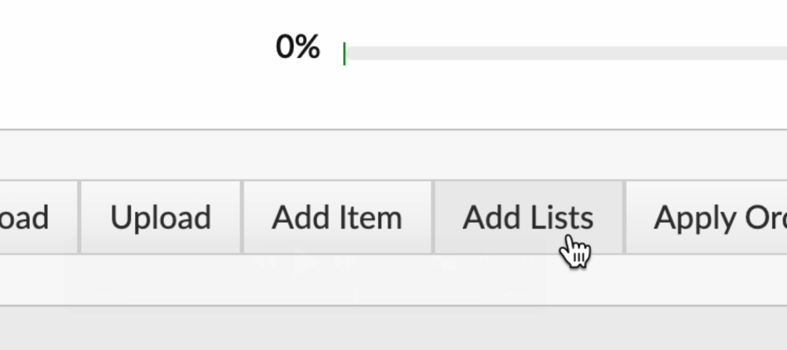

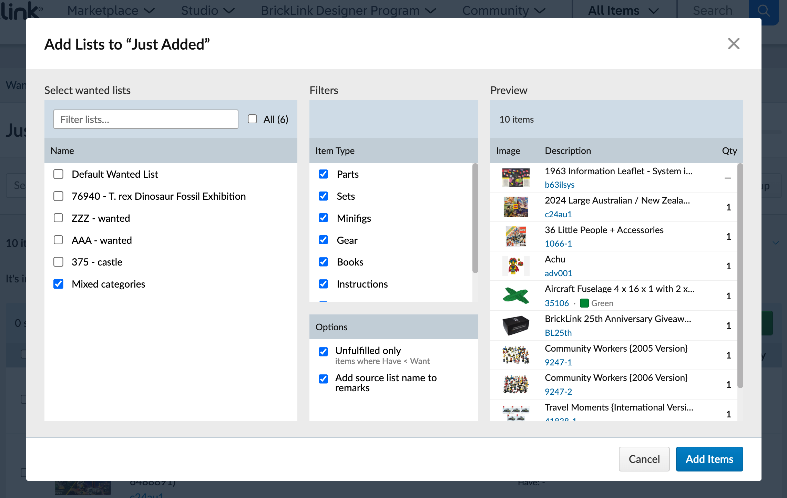

### Modals

#### Reverse Wanted List Order

Reverses the order of lists in the "Add to Wanted List" modal so your most recently created lists appear at the top.

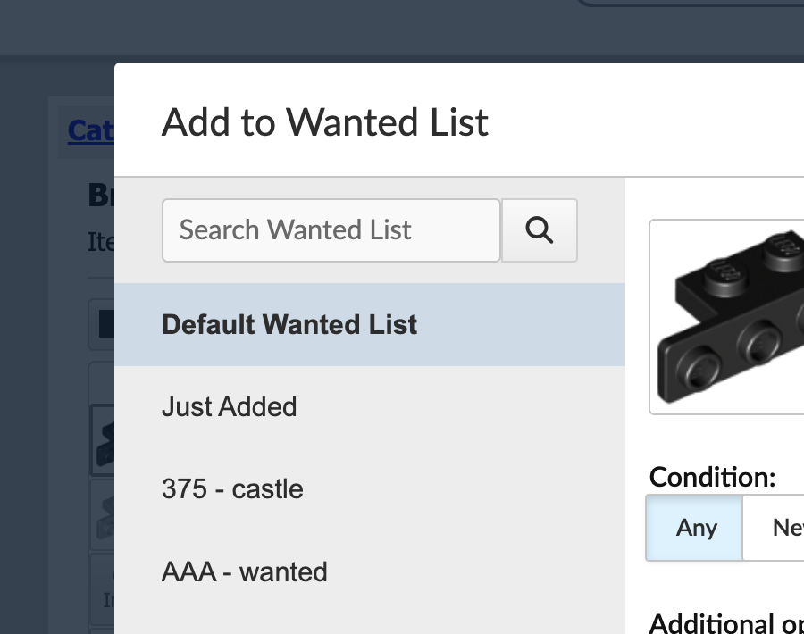

---

## Installation

### From the Chrome Web Store

*Coming soon.*

### From a release (manual)

1. Download the `.zip` from the [latest release](https://github.com/fantapop/refined-bricklink/releases/latest)
2. Unzip it
3. Go to `chrome://extensions` and enable **Developer mode**
4. Click **Load unpacked** and select the unzipped folder

### From source

```sh
git clone https://github.com/fantapop/refined-bricklink.git
cd refined-bricklink
npm install
npm run build
```

Then load the `build/source/` folder as an unpacked extension.

---

## Source verification

Releases are built automatically from tagged commits via [GitHub Actions](.github/workflows/release.yml). The version in [`source/manifest.json`](source/manifest.json) always matches the release tag.

GitHub displays a SHA256 checksum for each release artifact. Builds are reproducible — to verify the release zip was built from the published source, clone the repo at the matching tag and run `npm run build`. The SHA256 of `build/out/refined-bricklink-v0.2.0.zip` should match.

---

## Development

```sh
npm install          # install dependencies
npx vitest run       # unit tests
npx playwright test  # e2e tests (requires Chrome with extension loaded)
npm run build        # build to build/source/
```

See [CLAUDE.md](CLAUDE.md) for full developer documentation.

---

## Contributing

Feature requests are welcome — feel free to [open an issue](https://github.com/fantapop/refined-bricklink/issues).
